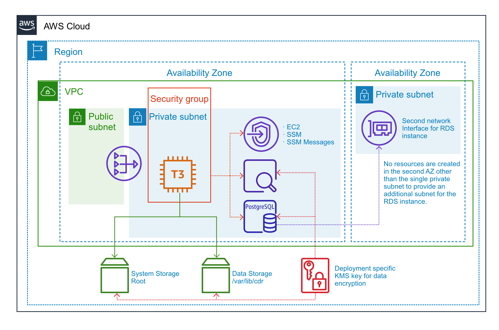

<!-- markdownlint-disable -->
# terraform-aws-cdr-link
<!-- markdownlint-restore -->

[![README Header][readme_header_img]][readme_header_link]

[![SR2 Communications Limited][logo]](https://www.sr2.uk/)

<!--


  ** DO NOT EDIT THIS FILE
  **
  ** This file was automatically generated by the `build-harness`.
  ** 1) Make all changes to `README.yaml`
  ** 2) Run `make init` (you only need to do this once)
  ** 3) Run`make readme` to rebuild this file.
  **
  ** (We maintain HUNDREDS of open source projects. This is how we maintain our sanity.)
  **


-->

*WARNING: Pre-release module. Do not rely on any of the inputs/outputs remaining stable here.*

Terraform module to deploy the base infrastructure for CDR Link to AWS. The deployment will be optimised for security
by default, although some features may be disabled in order to reduce costs. The following groups of resources will be
created:

* Virtual Private Cloud (VPC)
* Key Management Service (KMS) key
* PostgreSQL RDS instance
* Amazon OpenSearch Domain
* EC2 instance

### Architecture Overview



### Virtual Private Cloud (VPC)

A VPC is created to have tight control over the subnets in use. The deployment uses a single AWS region, and a single
availability zone (a single subnet is provisioned in a second availability zone due to the requirement that RDS
instances are attached to two subnets in different availability zones, but nothing else interacts with that subnet).

The deployment model intends that a zero-trust access solution is used to access the application (e.g. Cloudflare
Access) and so all resources containing the application and application data are provisioned into a private subnet.
No inbound access is permitted to the subnet. The instance must be managed via AWS Systems Manager (SSM).

A gateway endpoint is provisioned for S3. Interface endpoints are provisioned for EC2, SSM, SSM Messages, CloudWatch,
and KMS. Outbound Internet access is facilitated by a NAT gateway.

### Key Management Service (KMS) key

A single KMS key is created for the encryption of all storage resources. When archiving the deployment, it is possible
to provide the account ID to the `archive_account_id` variable to permit that account access to the KMS key to decrypt
the storage.  

### PostgreSQL RDS instance

*TODO*

### Amazon OpenSearch Domain

*TODO*

### EC2 instance

---


## Usage


**IMPORTANT:** We do not pin modules to versions in our examples because of the
difficulty of keeping the versions in the documentation in sync with the latest released versions.
We highly recommend that in your code you pin the version to the exact version you are
using so that your infrastructure remains stable, and update versions in a
systematic way so that they do not catch you by surprise.

Also, because of a bug in the Terraform registry ([hashicorp/terraform#21417](https://github.com/hashicorp/terraform/issues/21417)),
the registry shows many of our inputs as required when in fact they are optional.
The table below correctly indicates which inputs are required.


```hcl
module "link" {
  source = "sr2c/cdr-link/aws"
  # version = "x.x.x"
  namespace   = "eg"
  name        = "link"
  stage       = "dev"
}
```


<!-- markdownlint-disable -->
## Makefile Targets
```text
Available targets:

  help                                Help screen
  help/all                            Display help for all targets
  help/short                          This help short screen
  lint                                Lint terraform code

```
<!-- markdownlint-restore -->
<!-- markdownlint-disable -->
## Requirements

| Name | Version |
|------|---------|
| <a name="requirement_terraform"></a> [terraform](#requirement\_terraform) | >= 1.3.5 |
| <a name="requirement_aws"></a> [aws](#requirement\_aws) | >= 4.52.0 |
| <a name="requirement_cloudinit"></a> [cloudinit](#requirement\_cloudinit) | >= 2.2.0 |
| <a name="requirement_random"></a> [random](#requirement\_random) | >= 3.4.3 |
| <a name="requirement_tls"></a> [tls](#requirement\_tls) | >= 4.0.4 |

## Providers

| Name | Version |
|------|---------|
| <a name="provider_aws"></a> [aws](#provider\_aws) | 4.53.0 |
| <a name="provider_cloudinit"></a> [cloudinit](#provider\_cloudinit) | 2.2.0 |
| <a name="provider_random"></a> [random](#provider\_random) | 3.4.3 |
| <a name="provider_tls"></a> [tls](#provider\_tls) | 4.0.4 |

## Modules

| Name | Source | Version |
|------|--------|---------|
| <a name="module_dummy_subnet"></a> [dummy\_subnet](#module\_dummy\_subnet) | cloudposse/dynamic-subnets/aws | 2.1.0 |
| <a name="module_dynamic_subnet"></a> [dynamic\_subnet](#module\_dynamic\_subnet) | cloudposse/dynamic-subnets/aws | 2.1.0 |
| <a name="module_ec2_security_group"></a> [ec2\_security\_group](#module\_ec2\_security\_group) | cloudposse/security-group/aws | 2.0.0 |
| <a name="module_elasticsearch"></a> [elasticsearch](#module\_elasticsearch) | cloudposse/elasticsearch/aws | 0.35.1 |
| <a name="module_elasticsearch_label"></a> [elasticsearch\_label](#module\_elasticsearch\_label) | cloudposse/label/null | 0.25.0 |
| <a name="module_instance_role_profile"></a> [instance\_role\_profile](#module\_instance\_role\_profile) | sr2c/ec2-conf-log/aws | 0.0.2 |
| <a name="module_kms_key"></a> [kms\_key](#module\_kms\_key) | cloudposse/kms-key/aws | 0.12.1 |
| <a name="module_rds"></a> [rds](#module\_rds) | cloudposse/rds/aws | 0.40.0 |
| <a name="module_this"></a> [this](#module\_this) | cloudposse/label/null | 0.25.0 |
| <a name="module_vpc"></a> [vpc](#module\_vpc) | cloudposse/vpc/aws | 2.0.0 |
| <a name="module_vpc_endpoints"></a> [vpc\_endpoints](#module\_vpc\_endpoints) | cloudposse/vpc/aws//modules/vpc-endpoints | 2.0.0 |

## Resources

| Name | Type |
|------|------|
| [aws_ebs_volume.data](https://registry.terraform.io/providers/hashicorp/aws/latest/docs/resources/ebs_volume) | resource |
| [aws_elasticsearch_domain_policy.default](https://registry.terraform.io/providers/hashicorp/aws/latest/docs/resources/elasticsearch_domain_policy) | resource |
| [aws_instance.default](https://registry.terraform.io/providers/hashicorp/aws/latest/docs/resources/instance) | resource |
| [aws_key_pair.default](https://registry.terraform.io/providers/hashicorp/aws/latest/docs/resources/key_pair) | resource |
| [aws_volume_attachment.default](https://registry.terraform.io/providers/hashicorp/aws/latest/docs/resources/volume_attachment) | resource |
| [random_password.metamigo](https://registry.terraform.io/providers/hashicorp/random/latest/docs/resources/password) | resource |
| [random_password.metamigo_authenticator](https://registry.terraform.io/providers/hashicorp/random/latest/docs/resources/password) | resource |
| [random_password.rds_superuser](https://registry.terraform.io/providers/hashicorp/random/latest/docs/resources/password) | resource |
| [random_password.zammad](https://registry.terraform.io/providers/hashicorp/random/latest/docs/resources/password) | resource |
| [random_password.zammad_monitoring_token](https://registry.terraform.io/providers/hashicorp/random/latest/docs/resources/password) | resource |
| [tls_private_key.default](https://registry.terraform.io/providers/hashicorp/tls/latest/docs/resources/private_key) | resource |
| [aws_ami.default](https://registry.terraform.io/providers/hashicorp/aws/latest/docs/data-sources/ami) | data source |
| [aws_availability_zones.this](https://registry.terraform.io/providers/hashicorp/aws/latest/docs/data-sources/availability_zones) | data source |
| [aws_caller_identity.this](https://registry.terraform.io/providers/hashicorp/aws/latest/docs/data-sources/caller_identity) | data source |
| [aws_iam_policy_document.kms](https://registry.terraform.io/providers/hashicorp/aws/latest/docs/data-sources/iam_policy_document) | data source |
| [cloudinit_config.this](https://registry.terraform.io/providers/hashicorp/cloudinit/latest/docs/data-sources/config) | data source |

## Inputs

| Name | Description | Type | Default | Required |
|------|-------------|------|---------|:--------:|
| <a name="input_additional_tag_map"></a> [additional\_tag\_map](#input\_additional\_tag\_map) | Additional key-value pairs to add to each map in `tags_as_list_of_maps`. Not added to `tags` or `id`.<br>This is for some rare cases where resources want additional configuration of tags<br>and therefore take a list of maps with tag key, value, and additional configuration. | `map(string)` | `{}` | no |
| <a name="input_archive_account_id"></a> [archive\_account\_id](#input\_archive\_account\_id) | The AWS account ID of an account that should have access to the deployment's KMS key to facilitate archiving the<br>    deployment at the end of its lifecycle. | `string` | `null` | no |
| <a name="input_attributes"></a> [attributes](#input\_attributes) | ID element. Additional attributes (e.g. `workers` or `cluster`) to add to `id`,<br>in the order they appear in the list. New attributes are appended to the<br>end of the list. The elements of the list are joined by the `delimiter`<br>and treated as a single ID element. | `list(string)` | `[]` | no |
| <a name="input_context"></a> [context](#input\_context) | Single object for setting entire context at once.<br>See description of individual variables for details.<br>Leave string and numeric variables as `null` to use default value.<br>Individual variable settings (non-null) override settings in context object,<br>except for attributes, tags, and additional\_tag\_map, which are merged. | `any` | <pre>{<br>  "additional_tag_map": {},<br>  "attributes": [],<br>  "delimiter": null,<br>  "descriptor_formats": {},<br>  "enabled": true,<br>  "environment": null,<br>  "id_length_limit": null,<br>  "label_key_case": null,<br>  "label_order": [],<br>  "label_value_case": null,<br>  "labels_as_tags": [<br>    "unset"<br>  ],<br>  "name": null,<br>  "namespace": null,<br>  "regex_replace_chars": null,<br>  "stage": null,<br>  "tags": {},<br>  "tenant": null<br>}</pre> | no |
| <a name="input_delimiter"></a> [delimiter](#input\_delimiter) | Delimiter to be used between ID elements.<br>Defaults to `-` (hyphen). Set to `""` to use no delimiter at all. | `string` | `null` | no |
| <a name="input_descriptor_formats"></a> [descriptor\_formats](#input\_descriptor\_formats) | Describe additional descriptors to be output in the `descriptors` output map.<br>Map of maps. Keys are names of descriptors. Values are maps of the form<br>`{<br>   format = string<br>   labels = list(string)<br>}`<br>(Type is `any` so the map values can later be enhanced to provide additional options.)<br>`format` is a Terraform format string to be passed to the `format()` function.<br>`labels` is a list of labels, in order, to pass to `format()` function.<br>Label values will be normalized before being passed to `format()` so they will be<br>identical to how they appear in `id`.<br>Default is `{}` (`descriptors` output will be empty). | `any` | `{}` | no |
| <a name="input_ebs_volume_disk_allocation_gb"></a> [ebs\_volume\_disk\_allocation\_gb](#input\_ebs\_volume\_disk\_allocation\_gb) | The amount of storage to allocate for the EBS volume mounted at /var/lib/cdr inside the EC2 instance. If left<br>    unset, 10 GB will be allocated. | `number` | `null` | no |
| <a name="input_ec2_disk_allocation_gb"></a> [ec2\_disk\_allocation\_gb](#input\_ec2\_disk\_allocation\_gb) | The amount of storage to allocate for the EC2 instance. If left unset, the amount allocated will depend on the stage<br>    of the deployment. If the stage variable is set to "prod", 100 GB will be allocated, otherwise only 40 GB will be<br>    allocated. | `number` | `null` | no |
| <a name="input_ec2_instance_type"></a> [ec2\_instance\_type](#input\_ec2\_instance\_type) | The instance class for the EC2 instance. If left unset, the instance class will depend on the stage<br>    of the deployment. If the stage variable is set to "prod", t3.large will be use, otherwise only t3.medium. | `string` | `null` | no |
| <a name="input_enabled"></a> [enabled](#input\_enabled) | Set to false to prevent the module from creating any resources | `bool` | `null` | no |
| <a name="input_environment"></a> [environment](#input\_environment) | ID element. Usually used for region e.g. 'uw2', 'us-west-2', OR role 'prod', 'staging', 'dev', 'UAT' | `string` | `null` | no |
| <a name="input_es_allocated_disk_gb"></a> [es\_allocated\_disk\_gb](#input\_es\_allocated\_disk\_gb) | The amount of storage to allocate for the Elasticsearch domain. If left unset, 10 GB will be allocated. | `number` | `null` | no |
| <a name="input_es_enabled"></a> [es\_enabled](#input\_es\_enabled) | If set to false, no Elasticsearch resources will be created. This option may be used to reduce costs, with either<br>    the Elasticsearch server running within the Docker Compose stack on the EC2 instance at the expense of performance<br>    and reliability, or forgoing Elasticsearch entirely at the expense of full text search within Zammad. | `bool` | `true` | no |
| <a name="input_es_instance_type"></a> [es\_instance\_type](#input\_es\_instance\_type) | n/a | `string` | `null` | no |
| <a name="input_id_length_limit"></a> [id\_length\_limit](#input\_id\_length\_limit) | Limit `id` to this many characters (minimum 6).<br>Set to `0` for unlimited length.<br>Set to `null` for keep the existing setting, which defaults to `0`.<br>Does not affect `id_full`. | `number` | `null` | no |
| <a name="input_label_key_case"></a> [label\_key\_case](#input\_label\_key\_case) | Controls the letter case of the `tags` keys (label names) for tags generated by this module.<br>Does not affect keys of tags passed in via the `tags` input.<br>Possible values: `lower`, `title`, `upper`.<br>Default value: `title`. | `string` | `null` | no |
| <a name="input_label_order"></a> [label\_order](#input\_label\_order) | The order in which the labels (ID elements) appear in the `id`.<br>Defaults to ["namespace", "environment", "stage", "name", "attributes"].<br>You can omit any of the 6 labels ("tenant" is the 6th), but at least one must be present. | `list(string)` | <pre>[<br>  "namespace",<br>  "name",<br>  "tenant",<br>  "stage",<br>  "attributes"<br>]</pre> | no |
| <a name="input_label_value_case"></a> [label\_value\_case](#input\_label\_value\_case) | Controls the letter case of ID elements (labels) as included in `id`,<br>set as tag values, and output by this module individually.<br>Does not affect values of tags passed in via the `tags` input.<br>Possible values: `lower`, `title`, `upper` and `none` (no transformation).<br>Set this to `title` and set `delimiter` to `""` to yield Pascal Case IDs.<br>Default value: `lower`. | `string` | `null` | no |
| <a name="input_labels_as_tags"></a> [labels\_as\_tags](#input\_labels\_as\_tags) | Set of labels (ID elements) to include as tags in the `tags` output.<br>Default is to include all labels.<br>Tags with empty values will not be included in the `tags` output.<br>Set to `[]` to suppress all generated tags.<br>**Notes:**<br>  The value of the `name` tag, if included, will be the `id`, not the `name`.<br>  Unlike other `null-label` inputs, the initial setting of `labels_as_tags` cannot be<br>  changed in later chained modules. Attempts to change it will be silently ignored. | `set(string)` | <pre>[<br>  "default"<br>]</pre> | no |
| <a name="input_name"></a> [name](#input\_name) | ID element. Usually the component or solution name, e.g. 'app' or 'jenkins'.<br>This is the only ID element not also included as a `tag`.<br>The "name" tag is set to the full `id` string. There is no tag with the value of the `name` input. | `string` | `null` | no |
| <a name="input_namespace"></a> [namespace](#input\_namespace) | ID element. Usually an abbreviation of your organization name, e.g. 'eg' or 'cp', to help ensure generated IDs are globally unique | `string` | `null` | no |
| <a name="input_rds_allocated_disk_gb"></a> [rds\_allocated\_disk\_gb](#input\_rds\_allocated\_disk\_gb) | The amount of storage to allocate for the RDS instance. If left unset, 10 GB will be allocated. | `number` | `null` | no |
| <a name="input_rds_enabled"></a> [rds\_enabled](#input\_rds\_enabled) | If set to false, no RDS related resources will be created. This option may be used to reduce costs at the expense<br>    of reliability with the PostgreSQL server running in the Docker Compose stack in the EC2 instance. | `bool` | `true` | no |
| <a name="input_rds_instance_type"></a> [rds\_instance\_type](#input\_rds\_instance\_type) | The instance class of the PostgreSQL RDS instance to deploy. If left unset, db.t3.micro will be used. | `string` | `null` | no |
| <a name="input_regex_replace_chars"></a> [regex\_replace\_chars](#input\_regex\_replace\_chars) | Terraform regular expression (regex) string.<br>Characters matching the regex will be removed from the ID elements.<br>If not set, `"/[^a-zA-Z0-9-]/"` is used to remove all characters other than hyphens, letters and digits. | `string` | `null` | no |
| <a name="input_stage"></a> [stage](#input\_stage) | ID element. Usually used to indicate role, e.g. 'prod', 'staging', 'source', 'build', 'test', 'deploy', 'release' | `string` | `null` | no |
| <a name="input_tags"></a> [tags](#input\_tags) | Additional tags (e.g. `{'BusinessUnit': 'XYZ'}`).<br>Neither the tag keys nor the tag values will be modified by this module. | `map(string)` | `{}` | no |
| <a name="input_tenant"></a> [tenant](#input\_tenant) | ID element \_(Rarely used, not included by default)\_. A customer identifier, indicating who this instance of a resource is for | `string` | `null` | no |

## Outputs

| Name | Description |
|------|-------------|
| <a name="output_es_hostname"></a> [es\_hostname](#output\_es\_hostname) | n/a |
| <a name="output_instance_id"></a> [instance\_id](#output\_instance\_id) | n/a |
| <a name="output_rds_hostname"></a> [rds\_hostname](#output\_rds\_hostname) | n/a |
| <a name="output_rds_metamigo_authenticator_password"></a> [rds\_metamigo\_authenticator\_password](#output\_rds\_metamigo\_authenticator\_password) | n/a |
| <a name="output_rds_metamigo_password"></a> [rds\_metamigo\_password](#output\_rds\_metamigo\_password) | n/a |
| <a name="output_rds_port"></a> [rds\_port](#output\_rds\_port) | n/a |
| <a name="output_rds_superuser_password"></a> [rds\_superuser\_password](#output\_rds\_superuser\_password) | n/a |
| <a name="output_rds_superuser_user"></a> [rds\_superuser\_user](#output\_rds\_superuser\_user) | n/a |
| <a name="output_rds_zammad_password"></a> [rds\_zammad\_password](#output\_rds\_zammad\_password) | n/a |
| <a name="output_zammad_monitoring_token"></a> [zammad\_monitoring\_token](#output\_zammad\_monitoring\_token) | n/a |
<!-- markdownlint-restore -->


## Share the Love

Like this project? Please give it a ★ on [our GitLab](https://gitlab.com/sr2c/terraform-aws-cdr-link)! (it helps us **a lot**)


## Related Projects

Check out these related projects.

- [terraform-cloudflare-cdr-link](https://www.gitlab.com/sr2c/terraform-cloudflare-cdr-link/) - Terraform module to configure Cloudflare DNS and Cloudflare Access for CDR Link
- [terraform-null-label](https://github.com/cloudposse/terraform-null-label) - Terraform module designed to generate consistent names and tags for resources. Use terraform-null-label to implement a strict naming convention.


## References

For additional context, refer to some of these links.

- [CDR Link](https://digiresilience.org/solutions/link/) - CDR Link is a secure, flexible human rights helpdesk featuring messaging plugins for all popular platforms, enabling responders help communities seeking assistance.


## Help

**Got a question?** We got answers.

File a GitLab [issue](https://gitlab.com/sr2c/terraform-aws-cdr-link/-/issues), send us an [email][email] or join our [Matrix Community][matrix].

[![README Commercial Support][readme_commercial_support_img]][readme_commercial_support_link]

## Matrix Community

[][matrix]

Join our [Open Source Community][matrix] on Matrix. It's **FREE** for everyone! This is the best place to talk shop, ask questions, solicit feedback, and work together as a community to build on our open source code.

## Contributing

### Bug Reports & Feature Requests

Please use the [issue tracker](https://gitlab.com/sr2c/terraform-aws-cdr-link/-/issues) to report any bugs or file feature requests.

### Developing

If you are interested in being a contributor and want to get involved in developing this project or help out with our other projects, we would love to hear from you! Shoot us an [email][email].

In general, PRs are welcome. We follow the typical "fork-and-pull" Git workflow.

 1. **Fork** the repo on GitLab
 2. **Clone** the project to your own machine
 3. **Commit** changes to your own branch
 4. **Push** your work back up to your fork
 5. Submit a **Pull Request** so that we can review your changes

**NOTE:** Be sure to merge the latest changes from "upstream" before making a pull request!


## Copyrights

Copyright © 2021-2023 [SR2 Communications Limited](https://www.sr2.uk/)

Copyright © 2020-2023 [Guardian Project and contributors](https://www.guardianproject.info/)


## Trademarks

All other trademarks referenced herein are the property of their respective owners.

## About

This project is maintained by [SR2 Communications Limited][website].

[![SR2 Communications Limited][logo]][website]

We're a [DevOps services][website] company based in Aberdeen, Scotland. We ❤️ open source software and
specialise in digital human rights and humanitarian projects.

We offer [paid support][website] on all of our projects.

Check out [our other projects][gitlab], or [hire us][website] to get support with using our projects.

## Trans Rights

![Trans Rights Are Human Rights][trans_rights]

Trans is an umbrella term to describe people whose gender is not the same as, or does not sit comfortably with, the
sex they were assigned at birth. *Like all people*, they have the right to be treated with dignity and respect and to
have their human rights protected.

Transgender people face significant discrimination and prejudice in many areas of their lives, including employment,
education, housing, and healthcare. They are also at increased risk of violence and hate crimes. These issues
can have a serious impact on the physical and mental well-being of transgender people and can prevent them from fully
participating in society.

Transgender rights are therefore an important part of the broader struggle for human rights. Everyone, regardless of
their gender identity, should be able to live their lives free from discrimination and to enjoy the same rights and
opportunities as everyone else. This includes the right to express their gender identity and to be treated with respect
and dignity.

It is important for society to recognize and respect the rights of transgender people, and to take steps to address the
discrimination and prejudice that they face. This can include supporting policies and laws that protect transgender
people from discrimination and promoting acceptance and understanding of transgender people within the broader
community.

* [Gendered Intelligence](https://genderedintelligence.co.uk/) is a trans-led and trans-involving grassroots organisation
  with a wealth of lived experience, community connections of many kinds, and a depth and breadth of trans community
  knowledge. They offer staff training, consultancy, youth work, mentoring and undertake public engagement activities.

* [TransAid Cymru](https://transaid.cymru/) began life as a local mutual aid group in Cardiff. Tired of the ways that the
  electoral political system had let the trans community down, they decided it was time to do something for themselves.
  Many of the founding members were disabled and unemployed. Familiar with the real, material needs of the trans
  community and how little support there was out there, they founded the mutual aid group in order to provide the services
  the trans community needed.

If you have the means and you have benefited from this open source project, please consider making a donation to either
(or both) of the above groups.


## Contributors

<!-- markdownlint-disable -->
|  [![abel][abelxluck_avatar]][abelxluck_homepage]<br/>[abel][abelxluck_homepage] | [![irl][irlxyz_avatar]][irlxyz_homepage]<br/>[irl][irlxyz_homepage] | [![redaranj][redaranj_avatar]][redaranj_homepage]<br/>[redaranj][redaranj_homepage] |
|---|---|---|
<!-- markdownlint-restore -->

  [abelxluck_homepage]: https://gitlab.com/abelxluck
  [abelxluck_avatar]: https://secure.gravatar.com/avatar/0f605397e0ead93a68e1be26dc26481a?s=192&d=identicon

  [irlxyz_homepage]: https://gitlab.com/irlxyz
  [irlxyz_avatar]: https://gitlab.com/uploads/-/system/user/avatar/5895869/avatar.png?width=130
  [redaranj_homepage]: https://gitlab.com/redaranj
  [redaranj_avatar]: https://secure.gravatar.com/avatar/a4bb148b2c1a615f4b77b1e192f8e410?s=192&d=identicon


<!-- markdownlint-disable -->
  [logo]: https://www.sr2.uk/readme/logo.png
  [website]: https://www.sr2.uk/?utm_source=gitlab&utm_medium=readme&utm_campaign=sr2c/terraform-aws-cdr-link&utm_content=website
  [gitlab]: https://www.gitlab.com/sr2c
  [contact]: https://www.sr2.uk/
  [matrix]: https://matrix.to/#/%23dev:sr2.uk
  [linkedin]: https://www.linkedin.com/company/sr2uk/
  [email]: mailto:contact@sr2.uk
  [readme_header_img]: https://www.sr2.uk/readme/paid-support.png
  [readme_header_link]: https://www.sr2.uk/?utm_source=gitlab&utm_medium=readme&utm_campaign=sr2c/terraform-aws-cdr-link&utm_content=readme_header_link
  [readme_commercial_support_img]: https://www.sr2.uk/readme/paid-support.png
  [readme_commercial_support_link]: https://www.sr2.uk/?utm_source=gitlab&utm_medium=readme&utm_campaign=sr2c/terraform-aws-cdr-link&utm_content=readme_commercial_support_link
  [trans_rights]: https://img.shields.io/badge/Trans%20Rights-Human%20Rights-lightblue?logo=data:img/png;base64,iVBORw0KGgoAAAANSUhEUgAAABAAAAAQCAIAAACQkWg2AAAAGXRFWHRTb2Z0d2FyZQBBZG9iZSBJbWFnZVJlYWR5ccllPAAAADVJREFUeNpijD73i4EUwMRAIiBZA+PXlTsGm5P+//8/yJzE8m3VzkHmJNL9kKbqNMicBBBgAM3lCr5JiK9jAAAAAElFTkSuQmCC
<!-- markdownlint-restore -->
